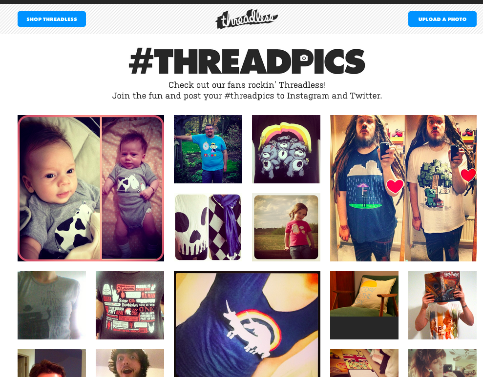
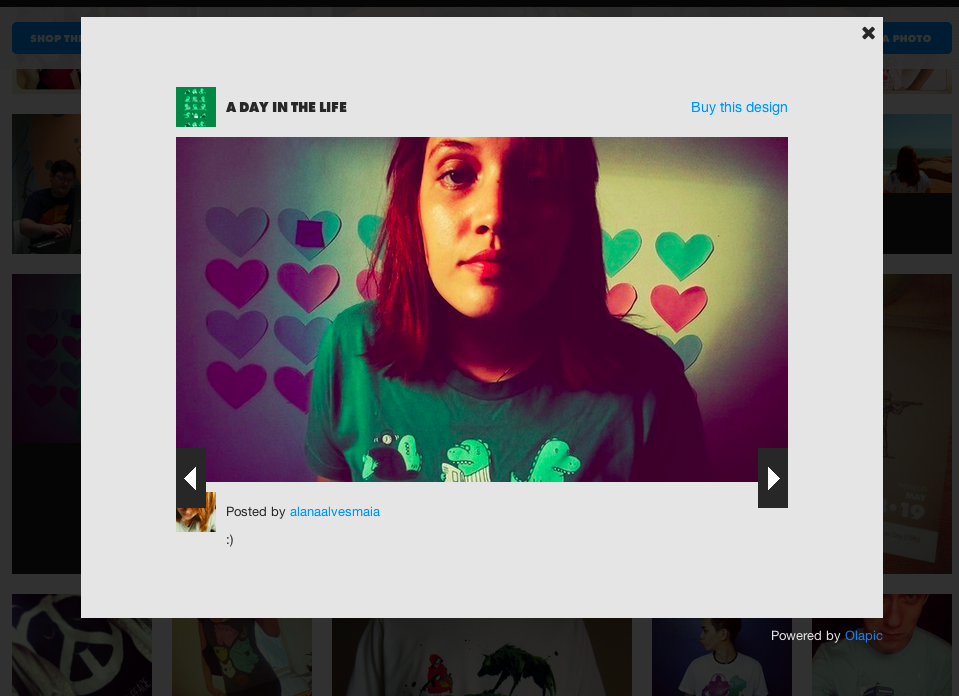
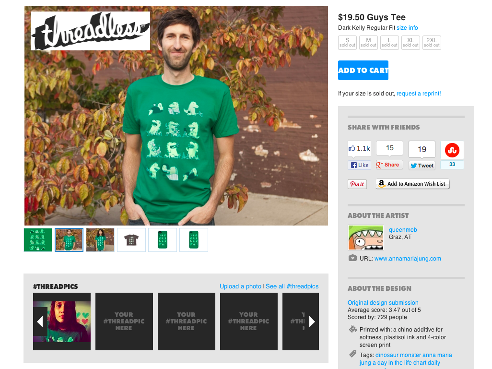
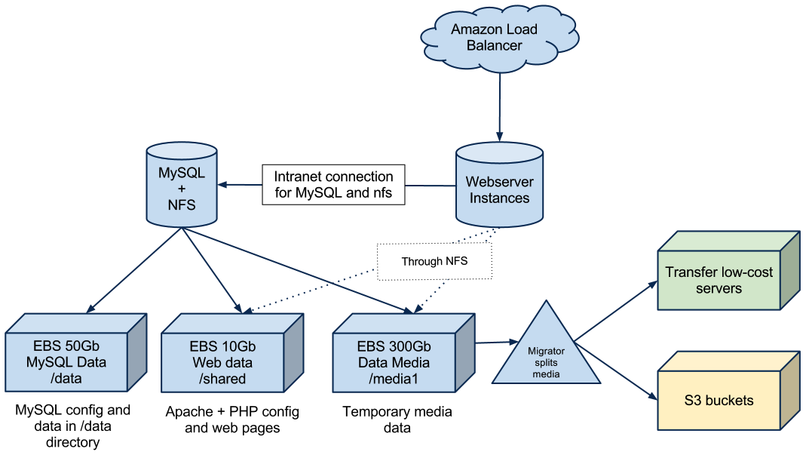
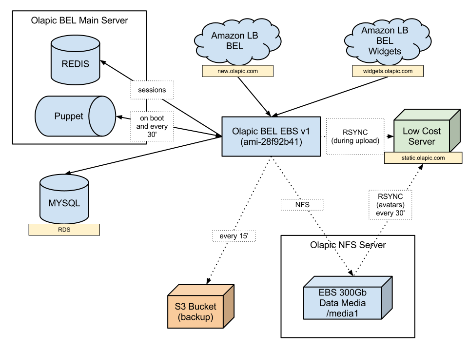
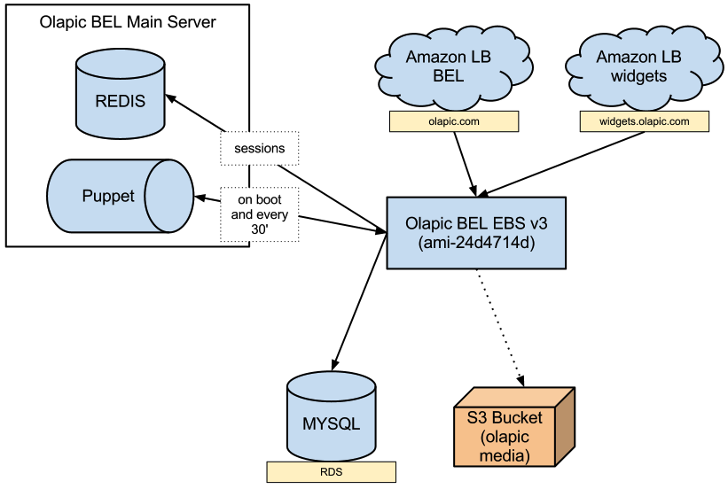
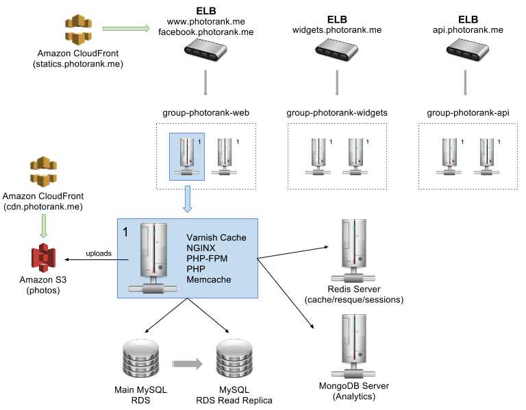

#Amazon Web Services
##Como lo usamos en Olapic

###Sebastián Alvarez • Intel • Mayo 2013

.fx: titleslide splash-grey

---

#Olapic

.fx: splash

---

.fx: imageslide whiteheading

---

.fx: imageslide whiteheading

---

.fx: imageslide whiteheading

---

#Amazon Web Services

.fx: splash

---

#Tools de AWS que usamos
- Route 53
- EC2
- RDS
- CloudWatch
- S3
- CloudFront

---

#Un poco de lo que fué

.fx: splash

---

.fx: imageslide whiteheading

---

.fx: imageslide whiteheading

---

.fx: imageslide whiteheading

---

#Lo que es hoy

.fx: splash

---

.fx: imageslide whiteheading

---

#Un AMI de Olapic

- Ubuntu Server
- Varnish
- NGINX
- PHP-FPM
- PHP
- Memcache
- Puppet
- Git

---

#+ Software 

- Redis
- MySQL
- MongoDB
- Jenkins
- Python
- VirtualBox (Local Dev)
- Resque

---

#Numeros al 22-05-2013

- ~10M Hits diarios
- ~1.5M pageviews diarios
- 120k Fotos publicadas activas
- 8.6k Commits en el master branch
- 20 Virtual Servers
- 13 Coders
- 3 ELB
- 2 MySQL RDS (1 Read Replica)
- 2 MongoDB (1 Slave)
- 1 Redis

---

#Preguntas?

.fx: splash

---

#Muchas gracias!

##Sebastian Alvarez

##http://aseba.github.com/Talks/

## @aseba

##sebas@olapic.com

.fx: titleslide splash-grey
